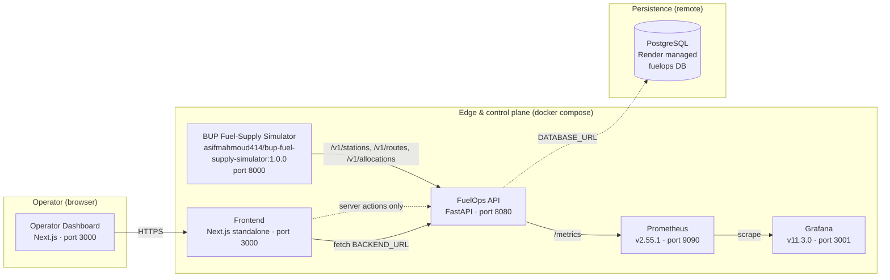
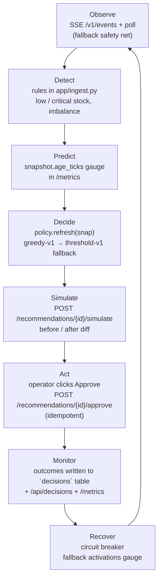
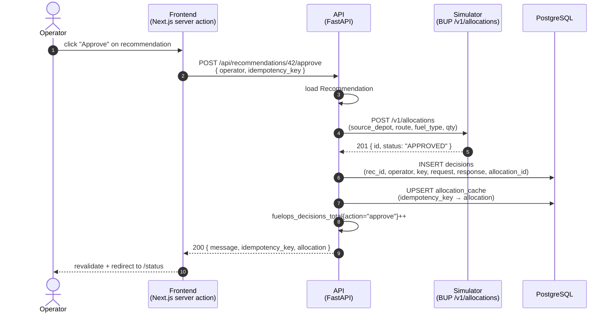

# FuelOps Architecture

This document is the **§20 deliverable #6** for the BUP hackathon: an architecture
diagram of the platform, drawn at three levels of detail so reviewers can read
the system at a glance or drill into the wiring.

> Looking for the live URL? Once the stack is up, every box below is reachable:
> - Frontend: <http://localhost:3000>
> - API: <http://localhost:8080/docs>
> - Prometheus: <http://localhost:9090>
> - Grafana: <http://localhost:3001> (admin / admin by default)

---

## 1. System diagram

A horizontal map of the runtime components. Solid arrows are HTTP/JSON
control traffic. Dashed arrows are data-plane traffic. The dotted arrow into
Postgres represents the remote connection from `api/.env`'s `DATABASE_URL`.

### What each box is for

| Component | Role |
|-----------|------|
| **Operator Dashboard** | Next.js UI. Reads `overview`, `alerts`, `recommendations` and shows them to the operator. Server actions call approve/reject. |
| **Frontend container** | The same Next.js app, served from the standalone build. The browser never talks to the API directly — it talks to the same container. |
| **FuelOps API** | FastAPI service. Polls the simulator's `/v1/events` SSE stream, maintains a local snapshot, runs the recommendation policy (greedy-v1 / threshold-v1 fallback), persists decisions, exposes Prometheus metrics. |
| **BUP Simulator** | Vendor-provided simulator of the Bangladesh fuel-distribution problem. Source of truth for stations, depots, routes, and the current network state. |
| **PostgreSQL (remote)** | Render-hosted. Stores snapshots, recommendations, decisions, allocation cache. |
| **Prometheus** | Scrapes the API's `/metrics` endpoint every 5 seconds. |
| **Grafana** | Provisions a Prometheus datasource + a 10-panel dashboard on first boot. |

---

## 2. The decision loop (data flow)

The platform exists to drive a single loop. Every other page in the UI is a
view onto one node in this loop.

The loop is observable end-to-end. Every arrow above has at least one
Prometheus metric, one Grafana panel, or one UI page dedicated to it.

---

## 3. Sequence diagram — operator approves a recommendation

This is the write path that matters for §14 / §18 / §23. It walks through
every box in §1 in the order they actually exchange messages.

### Failure handling

If the simulator returns 5xx or the SSE feed dies, the sequence changes:

- The **circuit breaker** on the simulator client opens after 3 consecutive
  failures. Approve is rejected with `503` until the breaker half-opens.
- The **fallback policy** (`threshold-vengivalone`) is used by `refresh()`
  when the breaker is open, so recommendations keep arriving even during
  outages.
- Every fallback activation bumps
  `fuelops_fallback_activations_total{policy="threshold-v1"}` so Grafana can
  show it on the dashboard.

---

## 4. Why these choices

A short note on what we traded off and why — for the architecture-conscious
judge.

| Decision | Why |
|----------|-----|
| **Postgres is remote, not a container** | Render already runs it; spinning up a second DB adds nothing. The compose stack talks to it via `DATABASE_URL`. |
| **Single API process** | The decision engine is in-process (`app/policy.py`) so it can use the live snapshot without a network hop. Splitting it out is a "future optimization" in the tech-stack guide, not a requirement. |
| **Server actions for approve/reject** | The Next.js UI doesn't expose its `OPERATOR_TOKEN` to the browser. The server action reads it from `process.env` and calls the API itself, keeping the auth header off the wire. |
| **Prometheus + Grafana over `docker stats`** | We need histograms (for p95/p99) and custom application gauges (`fallback_activations`, `sse_connected`). `docker stats` doesn't give us that. |
| **k6 over Locust/JMeter** | k6 is single-process (k6's own model: 1 VU per goroutine), so a single laptop can drive 50 VUs cleanly. The brief asks for a workload definition + numbers; k6's JS DSL makes both very compact. |

---

## 5. How to read the Grafana dashboard

The provisioned dashboard at <http://localhost:3001/d/fuelops-main> has 10
panels mapped 1-to-1 to the system diagram above:

| Panel | Maps to |
|-------|---------|
| API request rate | §1 box "FuelOps API" (call volume) |
| API p95 latency | §1 box "FuelOps API" (latency budget) |
| Error rate | §1 box "FuelOps API" (5xx counter) |
| SSE connected | §3 step "Client-Observed (SSE)" |
| Latency p50/p95/p99 | §1 box "FuelOps API" (histogram) |
| Requests by status code | §1 box "FuelOps API" (status mix) |
| Snapshot freshness + resilience | §1 box "PostgreSQL" + circuit breaker |
| Fallback policy activations | §2 node "Decide" (policy engine) |
| Recommendations + decisions / sec | §2 nodes "Decide" + "Act" |
| Simulator call latency per endpoint | §1 box "BUP Simulator" |

---

## See also

* [`./DEMO_SCRIPT.md`](./DEMO_SCRIPT.md) — the 14-step demo story
* [`./hackathon_guide.md`](./hackathon_guide.md) — the brief we built against
* [`../loadtest/`](../loadtest/) — k6 scripts
* [`../deploy/grafana-dashboard.json`](../deploy/grafana-dashboard.json) — the
  full Grafana dashboard definition